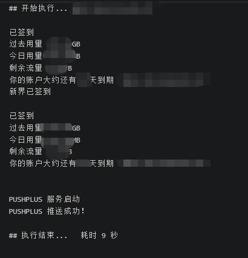

fork自原作者
更改为适用于新版青龙面板

### 0、功能

每天自动签到并用青龙自带notify.py推送

### 1、添加Secrets
| Secret Name  | Secret Value     |
| -----------  | ---------------- |
| USERNAME     | 登录账号 |
| PASSWORD     | 密码 |

### 2、需要支撑

chromium  
chromium-chromedriver  
requests  
selenium  

### 3、运行结果

